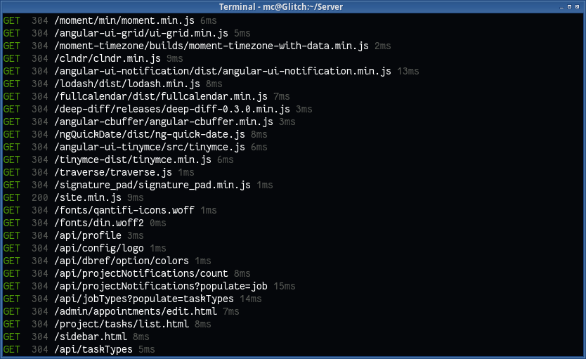

express-log-url
===============
Simple, nice-looking, logging for Express.




Installation
============

Install package
---------------

```
npm --save install express-log-url
```


Install within Express
----------------------

```javascript
// Somewhere within your server setup

app.use(require('express-log-url'));
```


Socket logging
---------------
The module also contains an extremely simple socket logging function:

```javascript
var io = require('socket.io').listen(server);
io.on('connect', socket => {
	socket.on('something', require('express-log-url').socket);
	socket.on('something', ()=> ...Actually do work...);
})
```


Manual logging
--------------
The module supports an object containing optional fields which will be output as if it were a fresh server request

```javascript
var logger = require('express-log-url');

// Simulate a GET request
logger.log({method: 'GET', code: 200, path: '/', responseTime: 10});

// Simulate a POST request with additional fields
logger.log({method: 'POST', code: 400, path: '/some/post', responseTime: 20, info: 'Lack of widgets'});
```

Supported fields:

| Field          | Description                                              |
|----------------|----------------------------------------------------------|
| `indent`       | Indentation to use. Is commonly a number of spaces       |
| `method`       | Short (ideally no more than 5 characters) method to show |
| `code`         | The status code returned by the server                   |
| `responseTime` | The time (in milliseconds) the server took to respond    |
| `info`         | Additional information to log against the request        |


Options
=======
Set the following options via `app.set('OPTION', 'VALUE');`

| Setting      | Type   | Default | Description               |
|--------------|--------|---------|---------------------------|
| `log.indent` | String | `null`  | Prefix for any log entry  |
